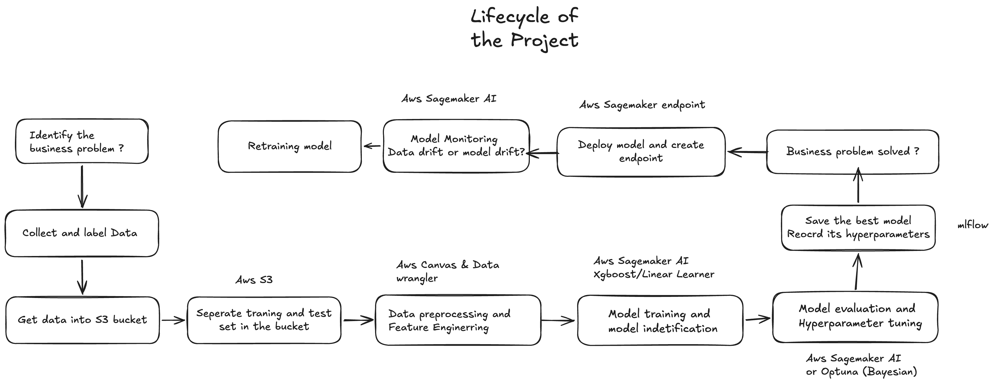
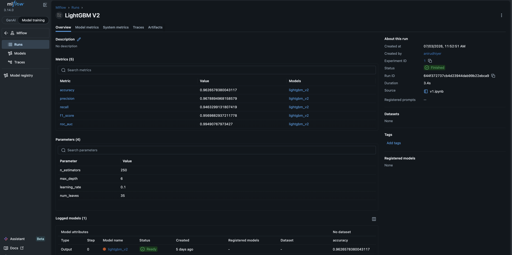
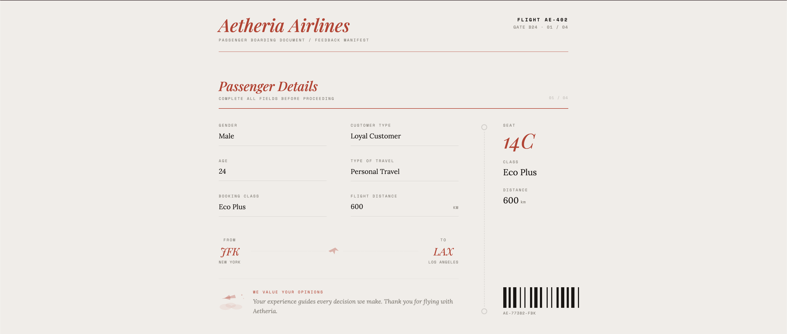
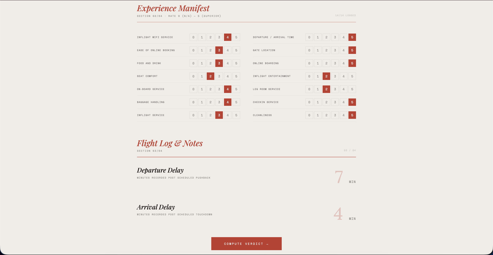
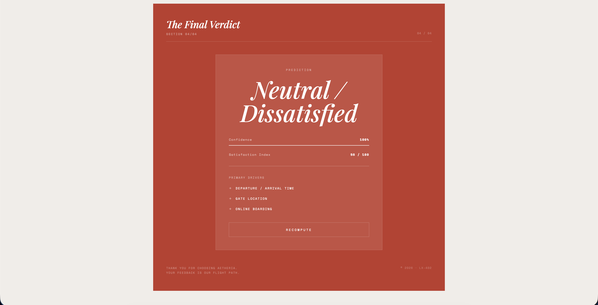

<div align="center">

#  AetheriaAI

### An End-to-End AWS MLOps Platform for Airline Passenger Satisfaction Prediction

Built using **Amazon S3 • SageMaker Canvas • Data Wrangler • SageMaker • MLflow • LightGBM • FastAPI**

---

*A production-oriented Machine Learning application demonstrating the complete AWS ML lifecycle—from cloud data storage and feature engineering to managed deployment and real-time inference.*

</div>

---

# Project Overview

AetheriaAI is an end-to-end Machine Learning application built on the **AWS Machine Learning ecosystem** for predicting airline passenger satisfaction.

Unlike conventional ML projects that stop after model training, AetheriaAI demonstrates a complete production-ready MLOps workflow where datasets are stored in **Amazon S3**, transformed using **Amazon SageMaker Canvas & Data Wrangler**, trained and deployed using **Amazon SageMaker**, monitored through **MLflow**, and exposed as a real-time prediction service using **FastAPI** and **AWS SageMaker Endpoints**.

The project showcases how modern Machine Learning systems are designed, trained, deployed, and consumed in cloud environments.

---

# AWS MLOps Pipeline

The complete project follows the AWS Machine Learning workflow.

```
Passenger Satisfaction Dataset
            │
            ▼
      Amazon S3
            │
            ▼
 SageMaker Canvas
            │
            ▼
    Data Wrangler
            │
            ▼
 Feature Engineering
            │
            ▼
  Model Training
            │
            ▼
 MLflow Tracking
            │
            ▼
 Champion Model
            │
            ▼
 SageMaker Model
            │
            ▼
 SageMaker Endpoint
            │
            ▼
 FastAPI Backend
            │
            ▼
 Airline Web Application
            │
            ▼
 Real-Time Predictions
```

---

#  System Architecture

<p align="center">

</p>

---

#  AWS Services Used

| AWS Service | Purpose |
|-------------|---------|
| Amazon S3 | Cloud storage for datasets and trained model artifacts |
| SageMaker Canvas | Data exploration and preprocessing |
| Data Wrangler | Feature engineering and transformation |
| SageMaker Training | Cloud-based model training |
| SageMaker Endpoint | Real-time model deployment |
| SageMaker Runtime | Online inference |
| IAM | Secure access management |

---

#  Features

##  AWS Cloud

- Amazon S3 Data Storage
- SageMaker Canvas Data Preparation
- Data Wrangler Feature Engineering
- Managed SageMaker Training Jobs
- SageMaker Endpoint Deployment
- Real-Time SageMaker Inference
- IAM Role-Based Security

---

##  Machine Learning

- LightGBM
- XGBoost
- Random Forest
- MLflow Experiment Tracking
- Cross Validation
- Model Comparison

---

##  Application

- FastAPI REST API
- Interactive Airline-Themed Web Interface
- Real-Time Passenger Satisfaction Prediction
- SageMaker Runtime Integration

---

#  Machine Learning Workflow

The complete machine learning pipeline consists of:

- Data Cleaning
- Feature Engineering
- Feature Encoding
- Model Training
- Cross Validation
- Model Evaluation
- MLflow Experiment Tracking
- Champion Model Selection
- AWS SageMaker Deployment

---

#  Model Performance

| Model | Accuracy | Precision | Recall | F1 Score |
| **LightGBM (Champion Model)** | **96.XX%** | **96.XX%** | **96.XX%** | **96.XX%** |

The LightGBM model was selected as the champion model after extensive experimentation and hyperparameter optimization due to its superior predictive performance across all evaluation metrics.

---

# Experiment Tracking

Every experiment was tracked using **MLflow**, enabling comparison of models, hyperparameters, evaluation metrics, and model artifacts.

<p align="center">

</p>

<p align="center">

</p>

---

# ☁ AWS Deployment

After selecting the champion model, the deployment workflow followed AWS SageMaker's managed deployment architecture.

```
LightGBM Model

        │

        ▼

Model Artifact (.tar.gz)

        │

        ▼

Amazon S3

        │

        ▼

SageMaker Model

        │

        ▼

Endpoint Configuration

        │

        ▼

Live SageMaker Endpoint

        │

        ▼

FastAPI Backend

        │

        ▼

Interactive Web Application

        │

        ▼

Passenger Satisfaction Prediction
```

The backend communicates with the deployed SageMaker Endpoint using the **AWS SageMaker Runtime API**, ensuring secure and scalable real-time inference without exposing AWS credentials to the frontend.

---

#  Application Preview

## Landing Page

<p align="center">

</p>

---

## Passenger Information

<p align="center">

</p>

---

## Prediction Result

<p align="center">

</p>

The web application collects passenger information and service ratings, sends the processed feature vector to a FastAPI backend, invokes the deployed AWS SageMaker Endpoint, and displays the predicted passenger satisfaction along with the model confidence score in real time.

---

# Technology Stack

## AWS

- Amazon S3
- Amazon SageMaker
- SageMaker Canvas
- Data Wrangler
- SageMaker Runtime
- IAM
- Boto3

---

## Machine Learning

- Python
- Pandas
- NumPy
- Scikit-Learn
- LightGBM
- XGBoost
- Random Forest
- MLflow

---

## Backend

- FastAPI
- Uvicorn

---

## Frontend

- React
- Tailwind CSS
- Figma Make

# ⚙ Installation

```bash
git clone https://github.com/<your-username>/aetheria-ai.git

cd aetheria-ai

python -m venv .venv

source .venv/bin/activate

pip install -r requirements.txt
```

---


#  Author

**Anirudh Iyer**

B.Tech Computer Science (AI & ML)

Passionate about Machine Learning, MLOps, Cloud AI.

---

##  If you found this project interesting, consider giving it a star!
